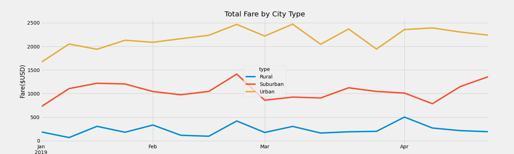

# PyBer_Analysis
Performing analysis on a ride sharing app company data

## Overview of the analysis
A ride sharing app company data, PyBer was analyzed using Python, Panda and Matplotlib to create variety of charts to showcase the relationships between the type of city, the number of drivers and riders as well as the percentage of total fares, riders and drivers by type of city. The analysis and visualization will help PyBer improve access to ride sharing services and determine affordability for underserved neighbourhoods.<br />

The PyBer data analysis project consists of two deliverables: <br />

1. Create a ride-sharing summary DataFrame by city type
    - Using the Pandas *groupby()* function with the *count()* and *sum()* methods on merged PyBer DataFrame columns,
        - Get the total number of rides, total number of drivers, and the total fares for each city type. 
        - Calculate the average fare per ride and average fare per driver for each city type. 
        - Add the data to a new DataFrame, then format the columns.
    
2. Create a multiple-line chart of total fares for each city type,
    - Use Pandas *pivot()* and *resample()* functions to create a multiple-line graph that shows the total fares for each week by city type.

## Resources
- Data Source: This analysis was performed using the [city_data.csv](https://github.com/aobasuyi/PyBer_Analysis/blob/main/Resources/city_data.csv) and the [ride_data.csv](https://github.com/aobasuyi/PyBer_Analysis/blob/main/Resources/ride_data.csv) datasets.
- Software: Python 3.7.6 :: Anaconda, Inc., conda 4.10.1, Jupyter NoteBook, Visual Studio Code, 1.56

## PyBer Results
The differences in ride-sharing data among the different city types are described below <br />

**The summary DataFrame** <br />

The following codes were used to get the total rides, total drivers and the total fares for each city type: <br />

```
total_rides_by_type = pyber_data_df.groupby(["type"]).count()["ride_id"]

total_drivers_by_type = city_data_df.groupby(["type"]).sum()["driver_count"]

total_fare_by_type = pyber_data_df.groupby(["type"]).sum()["fare"]

avg_fare_per_ride = total_fare_by_type / total_rides_by_type

avg_fare_per_driver = total_fare_by_type /total_drivers_by_type

```
<br />  <br />

**Finding:** summary dataframe <br />
 
- The total rides in urban cities are *13%* and *2.6%* more than the rides in rural and suburban cities respectively.
- The total drivers in urban cities are 26% and 5% more than the drivers ib rural and suburban cities respectively. 
- Rural cities charge the most fare per ride at approximately $35.
- Urban cities drivers earn the least per ride at approximately $17.

**Multiple-line plot that shows the total weekly of the fares for each type of city**
The multiple-line chart of total weekly fares from January to early May of 2019 was created using some of the codes shown below.

```
# Create a new DataFrame with multiple indices
sum_fares_by_type  = pyber_data_df.groupby(["type", "date"]).sum()[["fare"]]

# Create a pivot table with the 'date' as the index, the columns ='type', and values='fare'
sum_fares_by_type_pivot = sum_fares_by_type.pivot(index = "date", columns = "type", values = "fare") 

sum_fares_by_type_date = sum_fares_by_type_pivot.loc['2019-01-01':'2019-04-29']

# Set the "date" index to datetime datatype
sum_fares_by_type_date.index = pd.to_datetime(sum_fares_by_type_date.index)

# Create a new DataFrame using the "resample()" function by week 'W' 
weekly_fares_by_type = sum_fares_by_type_date.resample("W").sum()

```
**Finding:** multiple-line chart:  <br />

<br />  <br />

- Urban cities generate the most total weekly fares of all city types at about 3 times the weekly fares generated by rural cities, twice the amount generated by suburban cities respectively.
- Urban and suburban cities generated the least revenue in the first week of January 2019 comapred to rural cities.

## Summary

Some recommendations to address disparities among the city types include,
 - Initiate a social media blitz to promote awareness of app in rural areas to increase ridership.
 - Initiate promotions during the first week of January to increase ridership in urban and rural cities.
 - Consider incentives to encourage urban drivers to expand drive routes to suburban and/or rural areas.
